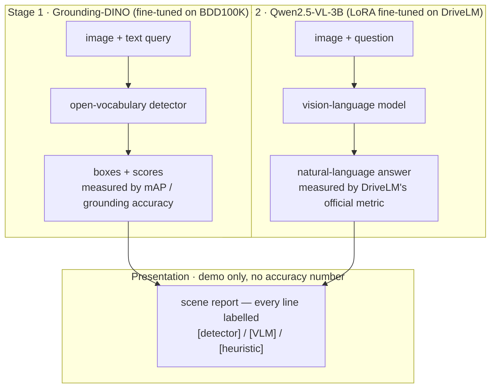

# Grounded Driving Perception

Open-vocabulary road-user detection + language grounding + driving-scene VQA, edge-benchmarked.

> **Status: in development — this README carries no results yet.**
> Every metrics table below is generated from a committed snapshot of `runs/*/metrics.json`
> (`docs/metrics_snapshot.json`), never typed by hand. Today every table says *Not yet measured* and
> names the exact blocker, because the fine-tuning and evaluation runs have not happened yet: they
> need cluster GPUs and datasets that are still being registered. Two stages *have* produced
> artifacts, but on synthetic fixtures — those render as pending too, because a number computed on
> `tests/fixtures/` is not a result. See `progress_report.md` for the full build narrative.

## What it does

Two stages, **two separate models, evaluated separately**:

1. **Grounded detection** — find any road user described in natural language ("the cyclist in the
   right lane"). `IDEA-Research/grounding-dino-tiny` fine-tuned on BDD100K. Reported as zero-shot →
   fine-tuned **mAP**, and **grounding accuracy** (IoU ≥ 0.5) on a curated descriptive-phrase set.
2. **Driving-scene QA, including risk reasoning** — answer questions about a scene ("is it safe to
   merge left?"). Qwen2.5-VL-3B LoRA fine-tuned on **DriveLM**, scored with the **official metric**,
   base vs fine-tuned, per category, with failure cases shown.

Then: quantize → ONNX → latency/FPS/memory benchmark → **accuracy-vs-latency curve**.

A demo composes both models into a readable **scene report**, with every line attributed to the
model that produced it. The demo is a demo — it carries no accuracy number.

## About "risk assessment"

Risk reasoning here is **measured, not asserted**: it is the accuracy on DriveLM's official
planning/behaviour questions — real ground truth, real metric, reported beside the base model's
score on the same split.

What this project deliberately does **not** do is ship a hand-written rule-based hazard engine with
a "risk detection accuracy" score. BDD100K is monocular with no calibration or depth ground truth,
so "distance to the lane boundary" isn't computable in metres, and scoring our own rules against our
own labels would be circular. Any heuristic risk overlay in the demo is badged as an unmeasured
illustration.

## Architecture



**These are two separate models.** They share a theme, not weights, not a forward pass, and not an
evaluation. The detector's boxes are not an input to the VLM, and the VLM's answers are not an input
to the detector; each is measured on its own benchmark against its own baseline. The only place
their outputs meet is the demo's scene report, which labels every line with the model that produced
it and claims no accuracy of its own.

Source of truth for the diagram: [`docs/architecture.mmd`](docs/architecture.mmd) (a test asserts
the two model subgraphs stay disjoint). [`docs/architecture-render.md`](docs/architecture-render.md)
has the one-line command to render a PNG for slides.

## Results

Every table below is rendered by `uv run gdp report render` from `docs/metrics_snapshot.json`, which
is built by `uv run gdp report snapshot` from `runs/<spec>/<timestamp>/*.json`. Hand-editing a number
inside a generated block fails `uv run pytest tests/test_report_render.py`.

### Stage 1 — detection mAP (BDD100K val)

Zero-shot is the baseline; the fine-tuned number is meaningless without it (H8).

<!-- BEGIN GENERATED: stage1-map -->
> **Not yet measured.** Blocked on: **spec 03 cluster fine-tuning run (`sbatch scripts/slurm/finetune_detector.slurm`), which itself needs spec 02's zero-shot baseline on real BDD100K**.
>
> This block is written by `uv run gdp report snapshot && uv run gdp report render` — never typed by hand.
<!-- END GENERATED: stage1-map -->

### Stage 1 — grounding accuracy (self-built phrase set)

<!-- BEGIN GENERATED: grounding -->
> **Not yet measured.** Blocked on: **spec 04 hand-authoring of the 150–300 real phrases, then `sbatch scripts/slurm/grounding_eval.slurm`**.
>
> This block is written by `uv run gdp report snapshot && uv run gdp report render` — never typed by hand.
<!-- END GENERATED: grounding -->

### Deployment — accuracy vs latency (M4 laptop as the edge target)

"Edge-deployed" here means **quantized, ONNX-exported, and latency-benchmarked on edge-class
compute** — nothing more. See *Honest scope* below.

<!-- BEGIN GENERATED: deployment -->
> **Not yet measured.** Blocked on: **spec 05 re-run on the real BDD100K val split (today's only run used `tests/fixtures/mini_bdd/`)**.
>
> This block is written by `uv run gdp report snapshot && uv run gdp report render` — never typed by hand.
>
> A run *does* exist (`runs/05-deploy/20260725-163907/metrics.json`), but last run was on tests/fixtures/ — not a result (H7). It is not rendered as a number, and no option makes it one.
<!-- END GENERATED: deployment -->

The accuracy-vs-latency curve itself is written to `runs/05-deploy/<timestamp>/curve.png` by
`uv run gdp deploy curve`.

### Stage 2 — DriveLM VQA (base vs LoRA fine-tuned)

<!-- BEGIN GENERATED: stage2-vqa -->
> **Not yet measured.** Blocked on: **spec 08 cluster evaluation run (`sbatch scripts/slurm/vqa_eval.slurm`), which itself needs spec 06's real DriveLM conversion and spec 07's LoRA adapter**.
>
> This block is written by `uv run gdp report snapshot && uv run gdp report render` — never typed by hand.
>
> A run *does* exist (`runs/08-vqa/20260726-204745/comparison.json`), but last run was on tests/fixtures/ — not a result (H7). It is not rendered as a number, and no option makes it one.
<!-- END GENERATED: stage2-vqa -->

## Failure analysis

`uv run gdp vqa failures` samples errors deterministically and stratified across DriveLM's four
categories, copies each frame, and writes `runs/08-vqa/<timestamp>/failures.md` with the question,
the ground-truth answer, **both** models' predictions, and an automatic ungrounded-tag count.

The per-item commentary fields are left **empty for a human to fill in**. An LLM writing the
commentary on an LLM's own failures is an unfalsifiable artifact, so the tool scaffolds and a person
judges. Like the tables above, this file is pending until spec 08's evaluation run happens.

## Honest scope — what this is NOT

- **Not pretrained from scratch.** Pretrained backbones are adapted, and the domain gain is
  measured. That is the industry workflow, and the measurement is the interesting part.
- **Not deployed in a vehicle.** "Edge-deployed" means quantized, ONNX-exported, and
  latency-benchmarked on edge-class compute. Nothing here has been near a car.
- **The ONNX export is fixed-vocabulary, not open-vocabulary.** Exporting requires freezing the
  text prompt to the 10 BDD classes; the exported artifact answers only those classes, not
  arbitrary natural-language queries. The open-vocabulary path stays in PyTorch — a deliberate
  export tradeoff, stated in `metrics.json` as `fixed_prompt: true`, not a silent regression.
- **No LiDAR, radar, or sensor fusion.** Camera-only.
- **No tracking, no trajectory prediction, no planning or control.** Single-frame perception and
  scene understanding; the rest of the AD stack is downstream and deliberately out of scope.
  Answering DriveLM's official planning and prediction *questions* in natural language is a
  benchmark VQA task, not a planner — the distinction is the module versus the question.
- **Not one joint model.** Stage 1 and Stage 2 are separate models that share a theme, not weights.
- **The VLM can hallucinate.** An ungrounded-object-tag diagnostic is reported for the base and the
  fine-tuned model on the same split. It is a self-defined diagnostic and is labelled as one.
- **The Stage-2 split is not the DriveLM leaderboard split**, and the official composite
  `final_score` is reported as `null`. Both are explained where the numbers appear.
- **The grounding phrase set is self-built.** It is the one sanctioned exception to "no self-invented
  benchmarks", allowed only because its construction, bias, and drop rate are documented in
  `data/grounding_eval/construction.md` — and it is labelled self-built everywhere it appears.
- **No self-invented benchmarks otherwise.** Capabilities without official ground truth — the scene
  report, any heuristic risk overlay, multi-frame reasoning — are shown as **labelled demos with no
  accuracy number**, never as results.

The full rules are the Honesty Register (H1–H9) in [`CLAUDE.md`](CLAUDE.md); they are enforced in
review by `/claims-check` and by the `claims-auditor` agent.

## Limitations & next steps

| Limitation | Why it exists | The concrete next step |
|---|---|---|
| **Single-frame only** — no temporal reasoning | Both benchmarks are frame-level; a temporal metric would have to be self-invented (H9) | `specs/11-temporal-demo.md`: multi-frame VLM reasoning as a **labelled demo with no metric**, explicitly first to be cut |
| **Camera-only** — no LiDAR/radar/fusion | Out of scope by design, not by accident: BDD100K and DriveLM/nuScenes-camera are the benchmarks with the ground truth this project measures against | Nothing here; fusion would be a different project with different benchmarks, and claiming it as "next" would misrepresent the work |
| **The grounding set is self-built** (a few hundred phrases, not an official benchmark) | No official descriptive-phrase grounding benchmark exists for BDD100K | Documented construction, bias, and drop rate in `data/grounding_eval/construction.md`; the honest upgrade is a public benchmark such as RefCOCO-style driving data, not more self-authored phrases |
| **No Jetson / TensorRT** | The measured edge target is the Apple M4 laptop, which is the hardware this project actually has | The ONNX artifact is the portable unit; re-benchmarking on a Jetson is a hardware acquisition, not a code change — and until it is run, no Jetson number is claimed |
| **The VLM is fine-tuned on a subsampled DriveLM train split** | 16 GB of laptop plus a shared cluster queue | The subsample is recorded (scene-stratified, with its record) in the run's own artifacts; the next step is the full train split on the cluster, which changes a config number and nothing else |
| **The official DriveLM composite `final_score` is not computed** | Two of its four weighted components require a paid, non-deterministic OpenAI judge | Reported as `null` with its composition and the reason, next to the sub-metrics that *are* computed; running the paid judge would make the number non-reproducible, which is a worse trade |

## Quickstart

Runs offline on a laptop against synthetic fixtures — no dataset download, no GPU:

```bash
make install      # uv sync
make test         # pytest
make smoke        # end-to-end: import → config → device → fixture → CLI
uv run gdp info   # resolved config + device
uv run gdp --help # the full roadmap: implemented commands work, the rest name their spec
```

Real datasets (BDD100K, DriveLM) require registration and are prepared by spec 01 / spec 06.

### Stage-2 data (DriveLM)

```bash
uv run gdp data prepare-drivelm -c configs/default.yaml --dataset mini_drivelm --split both
```

runs offline against a synthetic 4-scene fixture (`tests/fixtures/mini_drivelm/`), the same way
`gdp data prepare --dataset mini_bdd` does for Stage 1. The real command
(`docs/drivelm-download.md`) needs nuScenes + DriveLM registered and downloaded separately.

**The split is not the DriveLM leaderboard split.** DriveLM-nuScenes' challenge val/test answers
are withheld behind EvalAI, so `train.jsonl`/`val.jsonl` instead partition DriveLM's *answered*
train file by the **official nuScenes `v1.0-trainval` scene lists** (700 train / 150 val scenes,
vendored with provenance in `src/gdp/data/nuscenes_splits.json`) — scene-clean by construction, so
no near-duplicate 2 Hz frame from the same drive can appear in both train and val. Every artifact
this pipeline writes carries a `caveat` field naming this explicitly (never silently); see
`specs/06-data-drivelm.md`'s status note for the full resolution.

### The demo

```bash
uv run gdp demo            # Gradio: query→boxes, question→answer, attributed scene report
```

Runs today against the synthetic fixtures with the zero-shot detector and the base VLM, and badges
every panel accordingly. `--checkpoint` / `--adapter` swap in the fine-tuned artifacts when they
exist, with no code change.

## Reproduction

The laptop half of this project reproduces from a clean clone in one command:

```bash
bash scripts/repro_clean_clone.sh
```

It clones `HEAD` into a temporary directory and runs `make install` → `make test` → `make smoke` →
both fixture data pipelines → `gdp report render --check`, printing each step's exit code.

**It has been run, and all seven steps exited 0** (492 passed / 17 skipped in the clean clone —
the skips are the two optional extras a bare `uv sync` does not install). The run, and the three
test failures the first attempt found, are recorded in `progress_report.md`.

The cluster half (detector fine-tuning, VLM LoRA fine-tuning, full-split evaluation) is documented
in [`docs/reproduction.md`](docs/reproduction.md) with exact `sbatch` commands, configs, dataset
registration links, and expected runtimes. It is **labelled as not executed on this machine**,
because claiming an unrun reproduction is a claim like any other.

## Interview one-liners

Quoted verbatim from the project charter's appendix
([`grounded-driving-perception-spec.md`](grounded-driving-perception-spec.md)), which is immutable:

> - **"What does it do?"** Two things on driving scenes: find objects described in language
>   (fine-tuned open-vocabulary detection, measured by mAP and grounding accuracy) and answer
>   questions about the scene (a compact VLM fine-tuned and evaluated on the DriveLM/nuScenes-QA
>   benchmark) — both with a quantized, ONNX-exported, latency-benchmarked deployment path.
> - **"Did you train the models from scratch?"** No — I adapted pretrained open-vocabulary and VLM
>   backbones and *measured* the domain gain (zero-shot vs fine-tuned). That's the industry
>   workflow; pretraining from scratch would be neither feasible nor sensible here.
> - **"Why open-vocabulary instead of YOLO?"** Closed-set detectors can't see outside their
>   taxonomy; real roads always contain out-of-list objects. Open-vocabulary detection localizes
>   from language — and my fine-tuning quantifies how much domain adaptation improves it on driving
>   data.
> - **"What's the difference between detection and grounding here?"** Detection scores class-name
>   queries against labeled boxes (mAP); grounding scores *descriptive phrases* ("the cyclist in
>   the right lane") — same model, harder queries, evaluated on a curated set I designed and
>   documented.
> - **"Does the VLM hallucinate?"** Yes, sometimes — I report per-category accuracy on the official
>   benchmark split and show failure cases openly rather than hiding them.
> - **"Is it deployed in a car?"** No — "deployed" here means quantized, ONNX-exported, and
>   latency-benchmarked on edge-class compute, with the accuracy-vs-latency tradeoff published.
>   Vehicle integration is downstream of this project's scope.
> - **"Where does this sit in the AD stack?"** It's the perception + scene-understanding layer.
>   Tracking, prediction, and planning consume its outputs — deliberately out of scope, and I can
>   explain what each downstream layer would need from mine.
> - **"Why is this relevant to Honda?"** Job 6 asks for object-recognition models and edge
>   deployment; Job 7 requires training and deploying vision-based models; Job 4 lists VLM/LLM in
>   its tooling — this project is those lines, implemented and measured.
> - **"Biggest limitation?"** Camera-only and single-frame — no fusion, no temporal reasoning; and
>   grounding is evaluated on a curated set rather than a large official benchmark. All three are
>   clear, honest next steps.

**Two corrections since the charter was written.** The charter is immutable, so it is quoted as-is
and corrected here rather than edited:

1. *"No temporal reasoning"* is right about the **measured** scope and stays right — but
   `specs/11-temporal-demo.md` adds multi-frame reasoning as a **labelled demo with no metric**. If
   that spec ships, the honest sentence is "no temporal reasoning is *measured*; there is a
   multi-frame demo that claims no accuracy."
2. The **fixed-prompt ONNX caveat** is missing from the deployment one-liner. The full answer to
   "is it deployed?" adds: the exported graph is fixed-vocabulary, so the open-vocabulary capability
   lives in the PyTorch path, and the two are benchmarked separately.

## Layout

| Path | What |
|---|---|
| `grounded-driving-perception-spec.md` | The project charter (immutable) |
| `CLAUDE.md` | Agent constitution: honesty register + SDD loop |
| `specs/` | The spec backlog (00–11) and its status index |
| `progress_report.md` | Append-only story of the build: what, why, how, what broke |
| `src/gdp/` | The package |
| `docs/metrics_snapshot.json` | The committed snapshot every README number is rendered from |
| `tests/fixtures/mini_bdd/` | Synthetic Stage-1 scenes — **not real data**, never a source of results |
| `tests/fixtures/mini_drivelm/` | Synthetic Stage-2 DriveLM scenes — same rule, `is_synthetic: true` |

## Development

Spec-driven: `/new-spec → /plan → /tasks → /implement (one task) → /verify → /progress`.
No implementation code without an approved spec. Nothing is done until `progress_report.md` says how.

```bash
uv run gdp report snapshot   # runs/*/metrics.json -> docs/metrics_snapshot.json
uv run gdp report render     # snapshot -> README.md's generated blocks
uv run gdp report render --check   # exits 1 if a generated block was hand-edited
```
